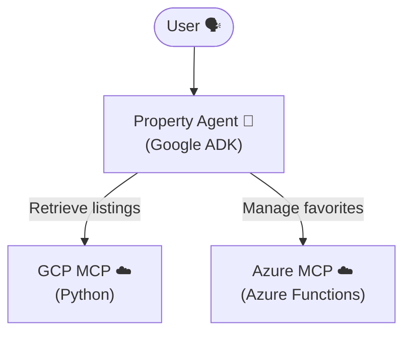

# Multi-Cloud Property Agent Demo

This repository demonstrates a multi-cloud architecture showcasing a real estate property agent built using the **Google ADK (Agent Development Kit)**. The agent orchestrates tools across both Google Cloud Platform (GCP) and Microsoft Azure to answer user queries and manage property data.

## 📂 Repository Structure

The workspace consists of three primary services:

-   **[`property_agent/`](./property_agent)**: The central Python-based AI agent using Google ADK. It acts as the coordinator between the user and the multi-cloud data sources.
-   **[`gcp_mcp/`](./gcp_mcp)**: A Python-based Model Context Protocol (MCP) server exposing commercial real estate listings data hosted in Google Cloud.
-   **[`azure_mcp/`](./azure_mcp)**: An Azure Functions-based Model Context Protocol (MCP) server providing personalized user-facing features (such as saving, retrieving and removing favorite listings).

---

## 🗺️ Architecture Diagram

---

## 🏗 High-Level Flow

1. **Query**: The user interacts with the `property_agent`.
2. **Retrieve**: The agent calls the **GCP MCP** to find specific property details (address, price, type).
3. **Persist/View State**: The agent uses the **Azure MCP** to query or store personalized data like user favorites.

---

## ❓ Example Questions

Here are some sample interactive queries the agent is designed to handle across the multi-cloud setup:

-   🗣️ **General Exploration**: *"What are the commercial properties available under management?"*
-   🔍 **Detailed Inquiry**: *"Tell me more about property ID CRE1007."*
-   💾 **Personalization**: *"Save CRE1007 as one of my favorite properties."*
-   📋 **Retrieval**: *"Show me a list of my favorite properties."*

---

## 🚦 Getting Started

Each system is self-contained with its own set of dependencies and environment variables. To run the full demo session, refer to the deep-dive guides inside each folder:

-   👉 [Property Agent README](./property_agent/README.md)
-   👉 [GCP MCP README](./gcp_mcp/README.md)
-   👉 [Azure MCP README](./azure_mcp/README.md)
